# 🚚 Distri Roma ERP — Enterprise Distribution & Logistics Platform

> **Caso de Estudio de Arquitectura, Gestión Financiera Atómica y Logística en Ruta.**  
> *Este repositorio documenta el diseño de software, la arquitectura de capas, los flujos transaccionales y los componentes UI de Distri Roma ERP, un sistema integral de gestión de recursos enfocado en distribuidoras de productos alimenticios y consumo masivo.*

---

## 📸 Resumen Ejecutivo & Tour Visual del Sistema

**Distri Roma ERP** resuelve la trazabilidad operativa completa de una distribuidora comercial: desde el control de inventario en depósito y la liquidación automática de compras, hasta la hoja de ruta en calle para repartidores, cobro en punto de venta (Efectivo, Transferencia, Cta. Cte.), gestión de cobranzas de morosos y emisión instantánea de comprobantes PDF.

---

### 1. Hub Principal, Tablero Financiero & Control de Gastos

| Menú Principal de Accesos Rápidos | Tablero de Control Financiero Mensual |
| :---: | :---: |
| 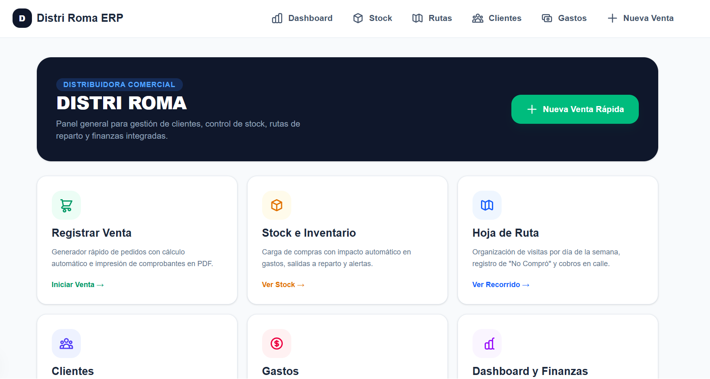 | 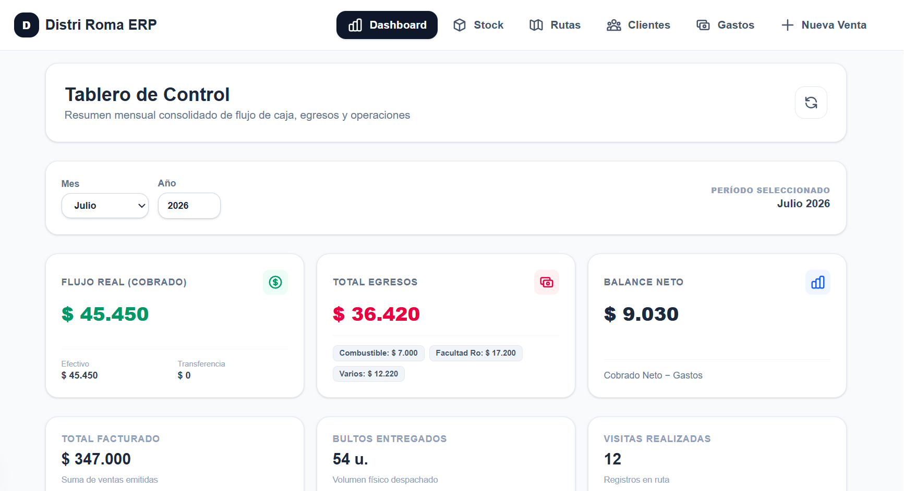 |

| Módulo de Control & Categorización de Gastos |
| :---: |
| 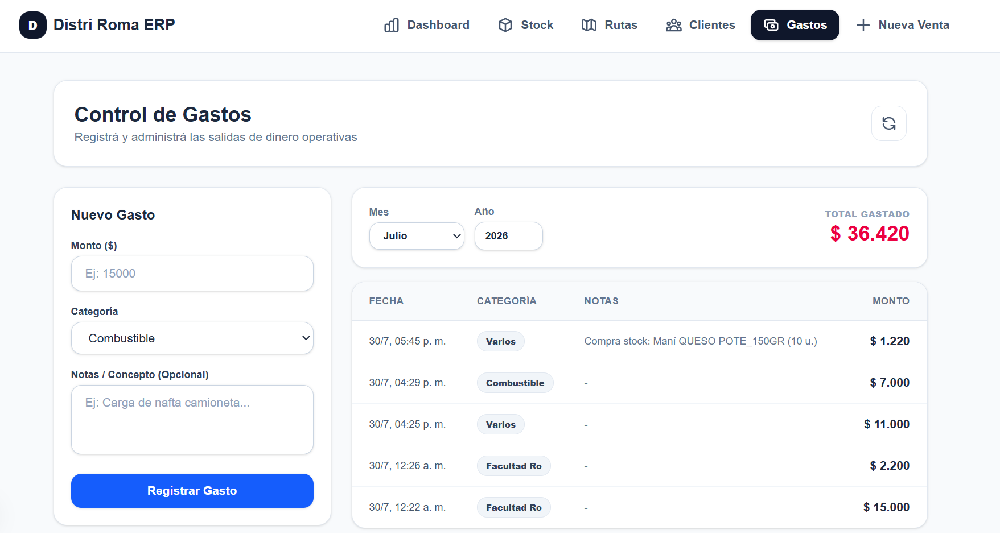 |
| *Auditoría histórica de egresos filtrada por año y categoría (Combustible, Facultad, Varios). Registra gastos manuales o automáticos provenientes de compras de stock.* |

---

### 2. Gestión de Inventario & Trigger Financiero de Compras

| Panel de Inventario & Alertas de Stock | Modal de Compra con Trigger de Gasto | Historial de Trazabilidad de Stock |
| :---: | :---: | :---: |
| 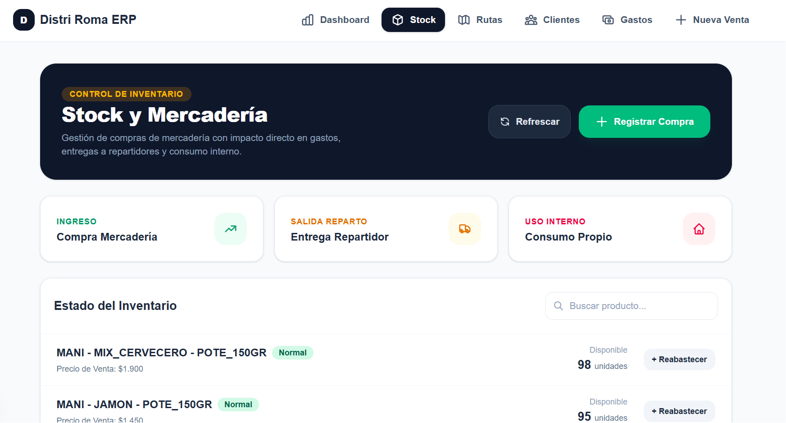 | 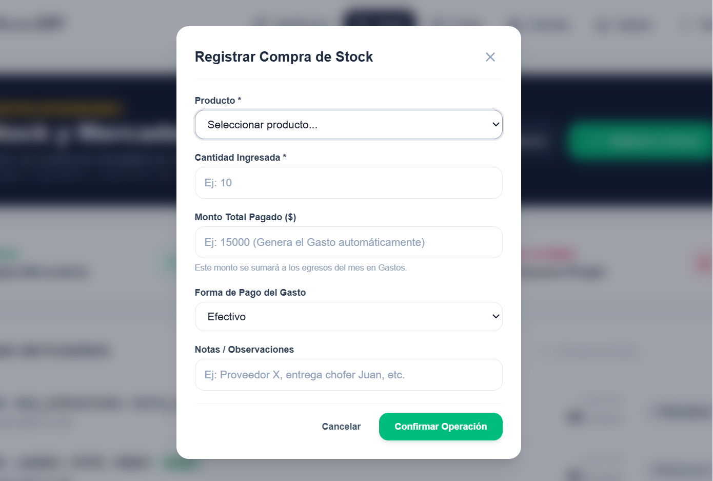 | 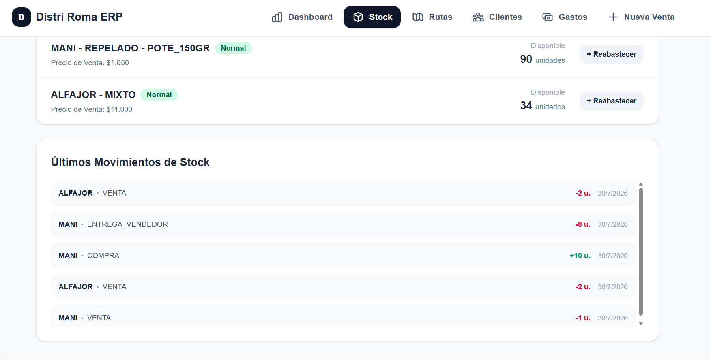 |

---

### 3. Módulo Logístico: Hoja de Ruta (Ciclo de 14 Días)

| Control de Rango de Visitas & Algoritmo de Frecuencia |
| :---: |
| 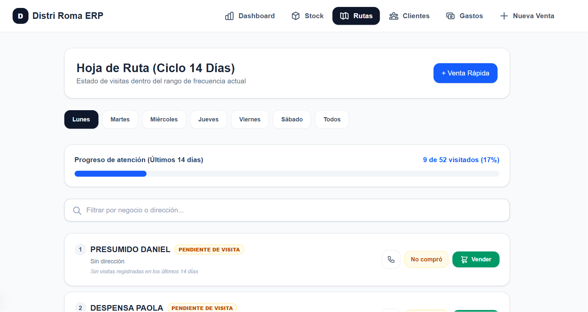 |
| *Mapea comercios por día de la semana. Registra eventos de "No compró" o venta directa en mostrador, reordenando automáticamente pendientes vs. visitados y reiniciando el ciclo cada 14 días.* |

---

### 4. Flujo de Punto de Venta (POS) & Generación de PDF

El módulo de ventas guía al repartidor o vendedor en 3 pasos optimizados para dispositivos móviles:

| Paso 1: Selección de Cliente | Paso 2: Selector de Productos & Cantidades | Paso 3: Medio de Pago & Emisión PDF |
| :---: | :---: | :---: |
| 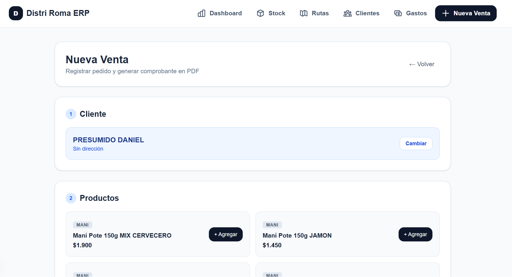 | 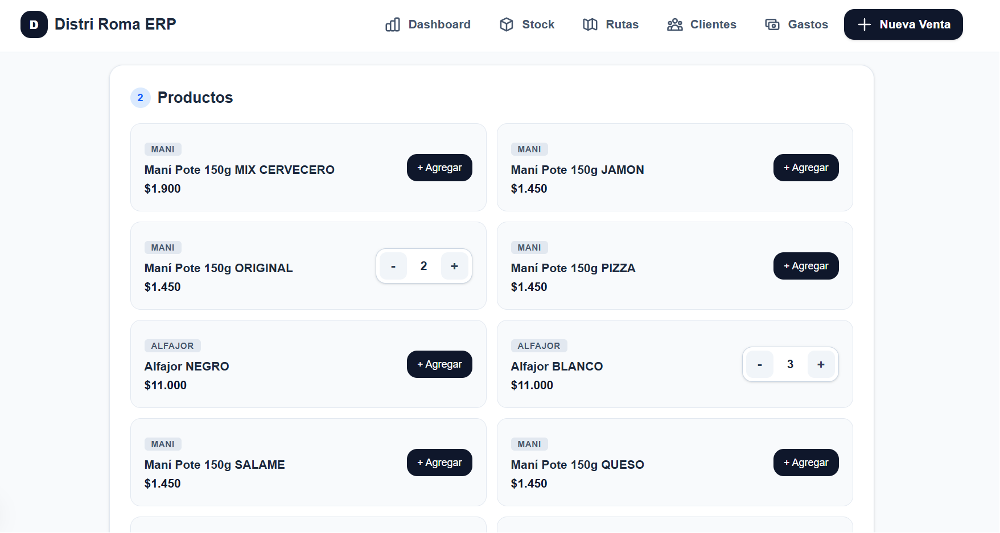 | 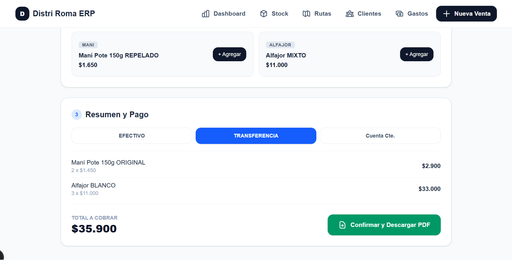 |

---

### 5. Directorio de Clientes, Control de Deuda & Cobranzas

| Directorio General de Clientes | Modal de Registrar Cobranza / Cancelación |
| :---: | :---: |
| 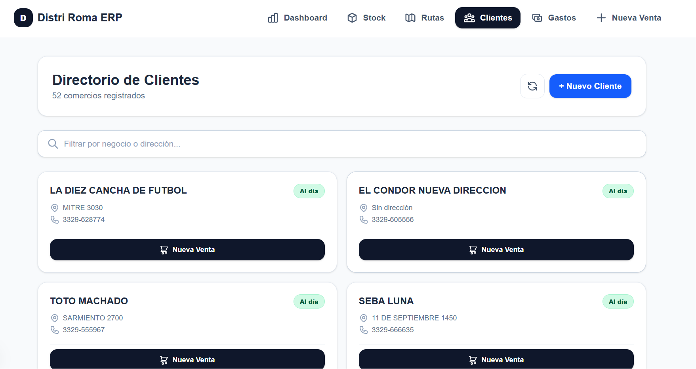 | 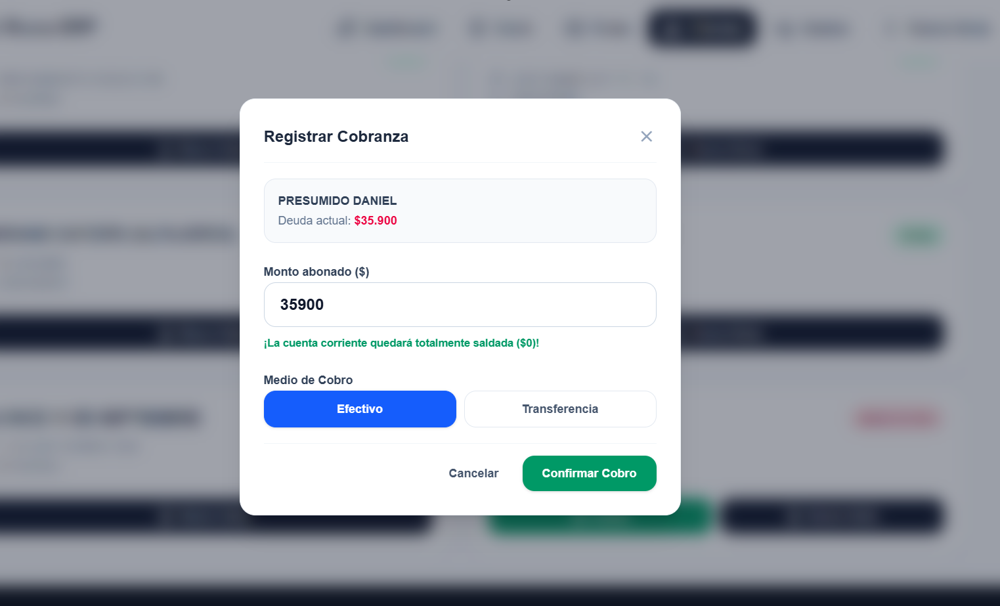 |
| *Consulta de estado crediticio ("Al día" vs. "Deuda pendiente").* | *Permite ingresar pagos parciales o totales de Cta. Cte., actualizando la caja en tiempo real.* |

---

## 🎯 Problemas Operativos vs. Solución de Software

### El Problema de Negocio
Las distribuidoras pyme suelen operar con procesos desconectados:
* Carga de compras de mercadería sin reflejo inmediato en el libro diario de gastos.
* Pérdida de control de clientes morosos por falta de seguimiento en rutas de reparto y gestión manual de cobritos.
* Descalce entre el dinero realmente cobrado (caja chica) y las facturas emitidas a crédito (Cta. Cte.).
* Falta de trazabilidad en salidas a reparto y consumos internos.

### La Solución de Arquitectura
1. **Financial Trigger Automático (`@Transactional`)**: Al registrar una compra de stock con monto mayor a cero, la capa de servicio invoca de forma atómica al módulo de Gastos, garantizando consistencia absoluta entre inventario y egresos.
2. **Ciclo de Atención Rastreable**: Algoritmo que evalúa la última fecha de visita por cliente dentro de una ventana móvil de 14 días.
3. **Gestión de Cobranzas en Calle**: Permite asentar pagos de saldos deudores directamente desde la ficha del cliente, generando el ingreso de caja en el día.
4. **Engine POS Multi-Pago**: Descuenta stock en tiempo real, registra la venta en la hoja de ruta, impacta la cuenta corriente si aplica y streamea la impresión del comprobante PDF en el dispositivo.

---

## 🔄 Arquitectura del Sistema & Integración de Capas

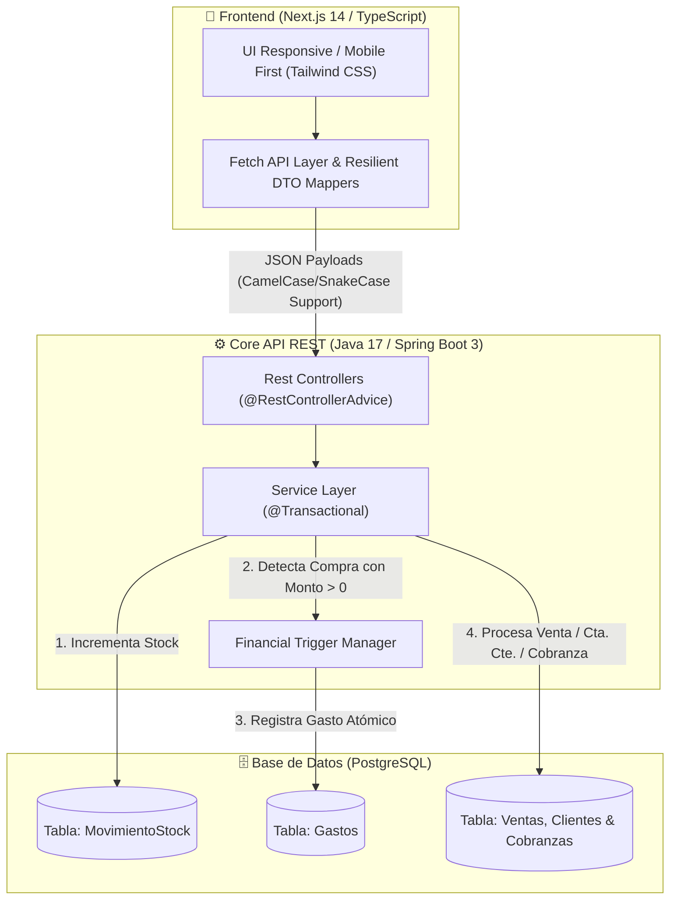

---
## ☁️ Arquitectura de Despliegue & Cloud (Producción)

El sistema se encuentra desplegado y operativo en una arquitectura distribuida de alta disponibilidad:

* **Frontend (Next.js 14):** Hosted en **Vercel** con despliegue continuo (CI/CD) desde rama `main` y optimización de assets en edge.
* **Backend API (Spring Boot 3):** Hosted en **Render** corriendo sobre Java 21, integrado con variables de entorno para la gestión segura de credenciales y políticas de CORS dinámicas.
* **Database (PostgreSQL):** Instancia gestionada en **Supabase**, con pool de conexiones optimizado, backups y ejecución de scripts de *seeding* transaccionales.
---

## ✒️ Autoría y Desarrollo

Diseñado, desarrollado e implementado por **Mateo Cagnoni**.
* **LinkedIn:** [linkedin.com/in/mateocagnoni](https://www.linkedin.com/in/mateocagnoni)
* **GitHub:** [@Mateoc63](https://github.com/Mateoc63)
